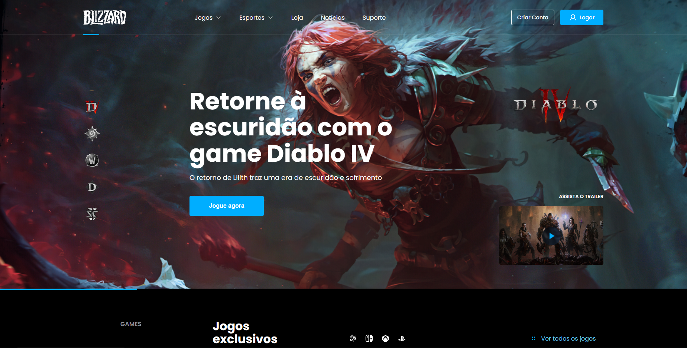

# Desafio Blizzard Landing Page
This project is a landing page for the Blizzard company, consisting of a navigation menu, a hero banner with information about the company's main games (Diablo, HearthStone, and World of Warcraft), a listing of exclusive games, and a footer with information about downloading the Battle.net app.

a Figma prototype was used as a basis, designed by Gilberto Prado. 

[Click here to see my solution to the challenge](https://blizzard-challenge-eight.vercel.app/)

## 🚀 Tecnologias

- [Next.js](https://nextjs.org/)
    Next.js is a JavaScript framework for building server-rendered React applications.

- [Stitches](https://stitches.dev/)
    Stitches is a lightweight CSS-in-JS library for styling React components with a minimalistic and intuitive API.

- [ESLint](https://github.com/eslint/eslint)
    ESLint is a tool for identifying and reporting patterns found in ECMAScript/JavaScript code. (Source: ESLint)


## Scripts
To run this app, follow these steps:


1. Clone the repository by running the following command:
```bash
$ git clone https://github.com/myzerx/blizzard-challenge
```
2. Enter the project folder:
```bash
$ cd blizzard-challenge
```

3. Install project dependencies using one of the following commands:
```bash
npm install
# or
yarn install
# or
pnpm install
```
4. Start the development server with one of the following commands:
```bash
npm dev
# or
yarn dev
# or
pnpm dev
```

By running the appropriate command, your app will be launched, and you can access it in your browser by navigating to ´localhost:3000´.

## 📝 Challenge Requirements

### Easy Level

- [x] Create sections: **Menu**, **Banner hero**, **Footer**.

- [ ] Modify the text and icon of the "Download game" button according to the user's operating system accessing the page. ([supporting material](https://developer.mozilla.org/en-US/docs/Web/API/Navigator/userAgent))

- [x] Apply hover effect to navigation menu options.

- [ ] Implement responsiveness for the following resolutions: 1920px, 1440px, 768px, and 375px.

### Medium Level

- [x] All requirements from the easy level.

- [x] Create sections: **Menu**, **Banner hero**, **Exclusive Games**, **Footer**.

- [x] Fetch the list of games via API. ([access endpoint](https://api-brchallenges.vercel.app/api/blizzard/games))

- [x] Apply hover effect to game images in the **Exclusive Games** section.

- [x] Update the information in the **Banner Hero** section when selecting an option from the sidebar menu. The available games are **Diablo**, **HearthStone**, and **World of Warcraft**.

### Hard Level

- [x] All requirements from the easy and medium levels.

- [x] When clicking on the **Login** button in the navigation menu, display the login modal.

- [x] Create a dropdown component for the **Games** and **Sports** options in the navigation menu.

- [ ] Play a game GIF when hovering over the trailer cover.